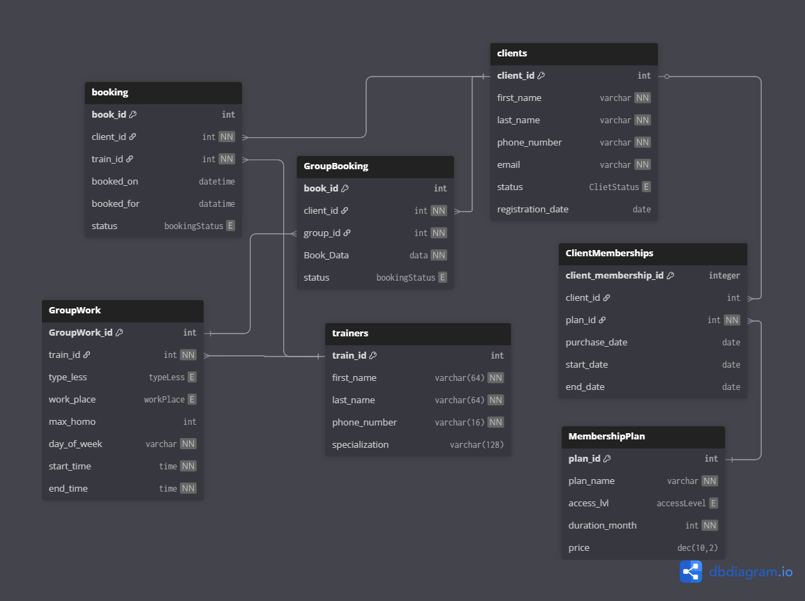

# **Лабораторна робота 1**

## 1. Вимоги для системи

### Вимоги до функціональності для клієнта (член клубу):

1. Система повинна надавати можливість реєстрації клієнта з обов’язковим зазначенням імені, номера телефону та електронної пошти.	
2. Система повинна надавати  клієнт можливість обирати тренера та тип занять(самостійні або групові).
3.Система повинна надавати можливість скасувати заняття з тренером (групові або індивідуальні) не менше ніж за 2 години до їх початку
4. Система надавати можливість обирати додаткові послуги (рівні доступу)

### Вимоги до функціональності для тренера:

1. Система повинна забезпечити тренера доступом до його особистого розкладу (як індивідуальних так і групових занять)
2. Тренер повинен могти переглядати списки членів клубу, які зареєструвалися на його групові заняття.
3. Система повинна дозволяти тренеру керувати своїми індивідуальними заняттями (назначати на вільний час, переносити, скасовувати)

### Вимоги до функціональності для адміністрації:

1. Система повинна забезпечувати можливість реєстрації нових клієнтів в системі
2. Система повинна надавати можливість вибору виду абонементу для клієнту (денний, вечірній, цілодобовий) та його тривалості(місяць, три, шість, рік)
3. Система повинна дозволяти переглядати список клієнтів, чиї абонементи закінчилися або закінчуються найближчим часом.
4. Система повинна забезпечувати можливість редагування даних клієнта (наприклад, зміни номера телефону).
5. Система має надавати можливість створювати нові заняття, призначати їм тренера, учасників, час та місце проведення.
6. Система повинна дозволяти скасовувати групові заняття.
7.Система повинна надавати доступ до всіх даних клубу: клієнтів, тренерів, абонементів, розкладу та історії записів.
8. Система повинна дозволяти керувати даними тренерів (додавати, видаляти, змінювати спеціалізацію).

## 2. Дані для зберігання

### 2.1 Сутності та атрибути

**Client (Клієнт)**
- ID (client_id) 
- Ім’я (first_name)
- Прізвище (last_name)
- Телефон (phone_number)
- Email (email)
- Дата реєстрації (registration_date)
- Статус (status)

**Trainer (Тренер)**
- ID (trainer_id) 
- Ім’я (first_name)
- Прізвище (last_name)
- Спеціалізація (specialization)
- Телефон (phone_number)

**MembershipPlan (Тип Абонементу)**
- ID (plan_id) 
- Назва (plan_name)
- Рівень доступу (access_lvl)
- Тривалість у місяцях (duration_month)
- Ціна (price)

**ClientMembership (Абонемент Клієнта)**
- ID (client_membership_id) 
- Клієнт (client_id) 
- Тип абонементу (plan_id)
- Дата покупки (purchase_date)
- Дата активації (start_date)
- Дата закінчення (end_date)

**Booking (Запис на індивідуальне заняття)**
- ID (booking_id) 
- Клієнт (client_id) 
- Тренер (train_id)
- Дата та час запису (booked_on)
- Дата та час завершення тренування (booked_for)
- Статус (status) 

**GroupWork (Групове заняття / Розклад)**
- ID (GroupWork_id) 
- Тренер (train_id)
- Тип заняття (type_less)
- Місце проведення (work_place)
- Максимальна кількість місць (max_homo)
- День тижня (day_of_week)
- Час початку (start_time)
- Час закінчення (end_time)

**GroupBooking (Запис на групове заняття)**
- ID (book_id) 
- Клієнт (client_id)
- Група (group_id)
- Дата запису (Book_Data)
- статус (status)

### 2.2 Таблиці з описом ключів та атрибутів

**Clients**
- client_id - Первинний ключ (PK)
- first_name - not null (Ім'я клієнта)
- last_name - not null (Прізвище клієнта)
- phone_number - not null, unique (Контактний телефон, має бути унікальним)
- email - not null, unique (Електронна пошта, має бути унікальною)
- status - ENUM ClietStatus ( поточний стан клієнта: active, frozen...)
- registration_date - date (Дата, коли клієнт був зареєстрований)

**Trainers** 
- train_id - Первинний ключ (PK)
- first_name - not null (Ім'я тренера)
- last_name - not null (Прізвище тренера)
- phone_number - not null, unique (Контактний телефон, має бути унікальним)
- specialization - (Напрямок роботи, напр. "Бокс", "GGym")

**MembershipPlan** 
- plan_id - Первинний ключ (PK)
- plan_name - not null (Назва тарифного плану, напр. "Денний", "Річний VIP")
- access_lvl - ENUM accessLevel (рівень доступу: Basic, Premium, VIP)
- duration_month - int, not null (Тривалість дії абонементу в місяцях)
- price - dec(10,2) (Вартість абонементу)

**ClientMemberships (Абонемент Клієнта)**
- client_membership_id - Первинний ключ (PK)
- client_id - Клієнт
- plan_id - тип абонементу
- purchase_date - date Дата покупки абонементу
- start_date - date Дата активації абонементу
- end_date - date Дата закінчення дії абонементу

**Booking (Запис на індивідуальне заняття)**
- book_id - Первинний ключ (PK)
- client_id - Клієнт
- train_id - Тренер, до якого записалися
- booked_on - datetime (Дата і час, на початок заброньованого трнування)
- booked_for - datetime (Дата і час, до якого заброньовано заняття)
- status - ENUM bookingStatus (статус запису: booked, canceled, pass)

**GroupWork (Групове заняття / Розклад)**
- GroupWork_id - Первинний ключ (PK)
- train_id - Тренер, який веде заняття
- type_less - ENUM typeLess (тип заняття: Box, Gymnastik...)
- work_place - ENUM workPlace (місце проведення: BoxRoom1, GymnastikRoom1...)
- max_homo - int (Максимальна кількість учасників у групі)
- day_of_week - varchar (День тижня, коли проводиться заняття)
- start_time - time (Час початку)
- end_time - time (Час закінчення)

**GroupBooking (Запис на групове заняття)**
- book_id - Первинний ключ (PK)
- client_id - Клієнт
- group_id - заняття
- Book_Data - datetime (Дата і час, початку броньованого заняття)
- status - ENUM bookingStatus (статус запису: booked, canceled, pass)

### 2.3 Зв’язки
Clients -ClientMemberships - MembershipPlan n:m Один клієнт протягом часу може мати різні типи абонементу, і кожен абонемент доступний для всіх клієнтів

Clients - booking - Trainers n:m Кожен клієнт може бронювати багато індивідуальних тренувань з різними (або одним) тренерами, кожен тренер може вести тренування у багатьох клієнтів(не одночасно). 

GroupWork - trainers n:1 кожен тренер може вести багато групових гуртків, але кожен груповий гурток веде лише 1 тренер

Clients - GroupBooking - GroupWork n:m Кожен клієнт може бронювати місце у багатьох групових заняттях, і на кожне заняття може бронюватися багато членів клубу

## 3.Бізнес-правила та Припущення
- Кожен клієнт має унікальну номер телефону та почту.
- Кожен клієнт може мати лише один активний абонемент.
- Клієнт може бронювати заняття лише тоді, коли має активний статус абонемента.
- Кожен тренер може проводити лише одне тренування одночасно
- Клієнт не може забронювати більше одного тренування на один час
- В одному залі для групових занять може займатися лише одна група з обмеженою кількістю учасників одночасно
- Якщо з бази видаляється Тренер то також відміняються всі заброньовані на нього тренування
- Клієнт може записатися на групове заняття лише тоді коли кількість записаних учасників не перевищує дозволеного максимума 
- Скасування бронювання клієнтом можливе не пізніше, ніж за 2 години до початку заняття.
- Якщо на групове заняття було заброньовано менше учасників ніж зазначений мінімум, адміністраці має право на власний розсуд його скасувати

 
